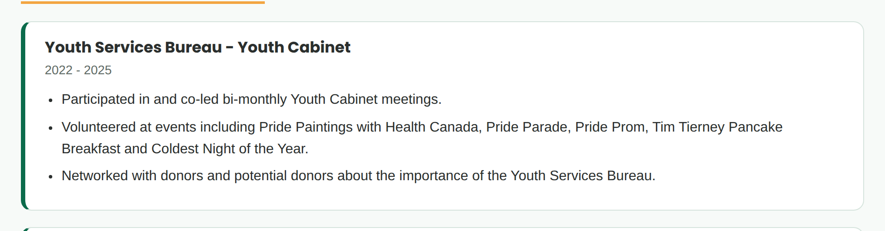
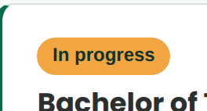
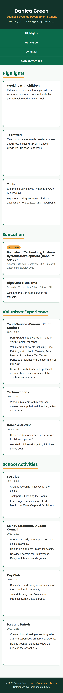

# Danica Green's Portfolio Design System 

This document purpose is to describe the design system for my portfolio website: the colors, typography, components and layout that every page is going to be built from. It includes screenshots of the HTML/CSS mock-ups to show what the design is going to look like before the site is built

## **1. Colour Palette**

We are using a simple yet slightly clever design colour palette throughout the design, with a description about what the color is going to be role is, the hex code and what is going to be used for 

- **Primary Colour:** `#0B6B4B` |Brand green: nav bar, headings, card left border, links|

- **Primary Dark:** `#12332A`|Header and footer background, nav hover|

- **Accent:** `#F2A541` |Heading underline, badges, tagline, footer links|

- **Background:** `#F7FAF8`|Page background|

- **Surface:** `#FFFFFF` |Card background|

- **Text:** `#2B2F2E`|Body Text|

- **Muted:** `#5F6B66`|Dates and secondary text|

- **Border:** `#D5E3DC`|Card borders and dividers|


---

## **2. Typography**

- **Body Text:** `"Inter", Arial, sans-serif`

- **Headers:** `"Inter", Arial, sans-serif`

- **Dates and notes:** `"Inter", Arial`

## **3. Components**

### Header
**Design**: Dark green background with a centered name, amber tagline, location and email

**Mock-up Screenshot**:


### Navigation
**Design**: Mid green bar, white bold links, darker green on hover

**Mock-up Screenshot**:


### Section heading 
**Design**: Green heading with amber underline

**Mock-up Screenshot**:


### Card
**Design**: White background, light green border, green left edge, rounded corners

**Mock-up Screenshot**:



### Badge
**Design**: Amber pill for status labels such as "In progress"

**Mock-up Screenshot**:



### Footer
**Design**: Dark green background, centered text, amber links

**Mock-up Screenshot**:


## **4. Layout**

- **Page width**: content centered and has side padding

- **Cards**: Cards sit side by side on wide screens and wrap on smaller ones 

- **Long entries**: with education and volunteer work they use a single column stack

- **Responsive breakpoint**: the nav list turns from horizontal to vertical and the card grids become one column 

### Full page (desktop)


### Mobile


## 5. Design Tokens in Code

```css
:root {
    --primary: #0B6B4B;
    --primary-dark: #12332A;
    --accent: #F2A541;
    --bg: #F7FAF8;
    --surface: #FFFFFF;
    --text: #2B2F2E;
    --muted: #5F6B66;
    --border: #D5E3DC;

    --font-main: "Inter", Arial, sans-serif;
    --font-headings: "Inter", Arial, sans-serif;
    --font-dates-notes: "Inter", Arial;
}
```

## Conclusion

This design system is the blueprint for the portfolio. It outlines the palette, the type scale and the components used so every page will stay consistent throughout the semester when new projects get added.